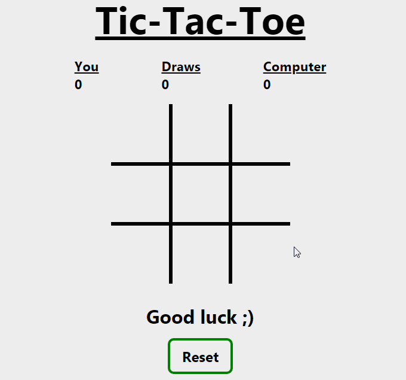

# Tic-Tac-Toe 

 

A classic game built using **HTML**, **CSS** & **JavaScript**. 
Check the live site **[here](https://tictactoeegame.netlify.app)**.

## Table of Contents
- [Game walkthrough](#game-walkthrough)
- [Brief](#brief)
- [Playing](#playing)
- [Web App](#web-app)
- [To-Do List](#to-do-list)
- [APIs used](#apis-used)
- [External Libraries used](#external-libraries-used)
- [Have an idea? or questions?](#have-an-idea-or-questions)
- [Found a bug?](#found-a-bug)
- [Contributing](#contributing)
- [Contact](#contact)

## Game Walkthrough
Example of the game made: 

## Brief
Tic-tac-toe is a game for two players, :x: and :o:, who take turns marking the spaces in a 3×3 grid. The player who succeeds in placing three of their marks in a diagonal, horizontal, or vertical row is the winner.
___

### <b>Playing</b>:
- **X** plays first
- Click on any grid box to play your move
- Click reset button after completion to reset the board and play again

 ## Web App
 While you can go to the [website](https://tictactoeegame.netlify.app) to play, I would suggest you to use the **web app** so that you don't have to go to the browser and type in the website everytime to want to play. You can directly open the **web application** on your **home screen** or the **desktop shortcut** on your computer to play. 

 **Follow the steps:**
1. For desktop users
- Chrome
    - Open the [website](https://tictactoeegame.netlify.app)
    - Tap the **three dots &#8942;** on the top right corner
    - Click on **More tools**
    - Click on **Create shortcut**
    - Check **Open as window** option and click create
2. For mobile users
- Chrome
    - Navigate to the [website](https://tictactoeegame.netlify.app)
    - Tap the **three dots &#8942;** on the top right corner
    - Scroll down and click on **Add to home screen**
    - Click **Add**
- Safari
    - Navigate to the [website](https://tictactoeegame.netlify.app)
    - Click on **Share icon** at bottom  
    (On the iPad, share icon is located at the **top-right**)
    - Tap **Add to home screen** from the menu
    - Type name for shortcut and then tap **Add** button

Now you can use this game as a **Web App**. 
The process might be similar for other browsers too.

 ## To-Do List
 This contains the list of features I'm working on or wish to implement them in future.
 - [x] Adding two player mode
 - [ ] Giving user the option to either play as :x: or :o:
 - [x] Showing scores
 - [ ] :x: and :o: animate while making a move
 - [ ] Linethrough on the respective column, row or diagonal when a player wins
 - [x] Adding AI using JavaScript minimax algorithm
 - [ ] Adding different levels that user can select to play against computer. e.g. Easy, hard, unbeatable
 - [ ] Adding multiplayer mode

>Know how to implement these features and contribute? Check [Contributions](#contributing) section. 
**Have more ideas?** Check [this](#have-an-idea-or-questions)

## APIs used
[Web Share API](https://developer.mozilla.org/en-US/docs/Web/API/Web_Share_API) - It provides a way to trigger the native share dialog of a device when sharing content, directly from a website or web application.

## External Libraries used
[PWACompat](https://github.com/GoogleChromeLabs/pwacompat) - PWACompat is a library that brings the Web App Manifest to non-compliant browsers for better Progressive Web Apps. 
Read more on their [blog](https://developers.google.com/web/updates/2018/07/pwacompat).

## Have an idea? or questions?
If you have an amazing idea for this game, or you got some questions, you can discuss them in the [discussions](https://github.com/AyushShahh/Tic-Tac-Toe/discussions) tab.

---
If you want to implement your idea by contributing, check [contributing](#contributing) section.

## Found a bug?
If you find a bug, you can always **open an issue** in the [issues tab](https://github.com/AyushShahh/Tic-Tac-Toe/issues) to talk about it. Still, if you want to **contact me**, check [here](#contact).

---
**Note:** Make sure you browse through the existing issues to check if the issue already exists. 
>Know a fix or want to contribute? Check [contributions](#contributing) section.

## Contributing
Pull requests are always welcome. But before making any major changes you can open an [issue](https://github.com/AyushShahh/Tic-Tac-Toe/issues) to discuss.

For less major or minor changes, you can open a [pull request](https://github.com/AyushShahh/Tic-Tac-Toe/pulls).

You can also [contact](#contact) me. 
**Thanks for contributing.**

# Contact
I don't like spams

  
&nbsp;&nbsp;&nbsp; 
&nbsp;&nbsp;&nbsp; 
&nbsp;&nbsp;&nbsp; 
&nbsp;&nbsp;&nbsp; 

 

**[Back to top](#tic-tac-toe-)**