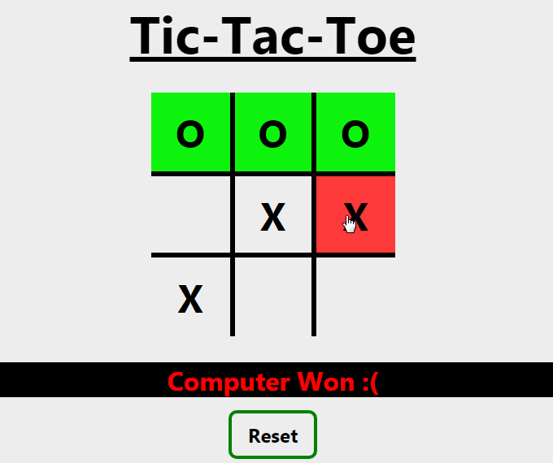

# Tic-Tac-Toe 

> A classic game built using **HTML**, **CSS** & **JavaScript**. 
> View the live demo **[here](https://tictactoeegame.netlify.app)**.

## Table of Contents
- [Game walkthrough](#game-walkthrough)
- [Brief](#brief)
- [Playing](#playing)
- [Web App](#web-app)
- [To-Do List](#to-do-list)

## Game Walkthrough
Example of the game made: 

## Brief
Tic-tac-toe is a game for two players, :x: and :o:, who take turns marking the spaces in a 3×3 grid. The player who succeeds in placing three of their marks in a diagonal, horizontal, or vertical row is the winner.

_ _ _
In **<u>this game</u>**, you will be playing as :x: & computer will be playing as :o:

### Playing
- :x: plays first.
- Click on any grid box to play your move.
- Click reset button after completion to reset the board and play again.

**Note:**  
 Currently, there is no (real) computer playing against you. 
 It is just a JS code that plays randomly, regardless of your move. 

 ### Web App
 While you can go to the [website](https://tictactoeegame.netlify.app) to play, I would suggest you to use the **<u>web app</u>** so that you don't have to go to the browser and type in the website everytime to want to play. You can directly open the **web application** on your **home screen** or the **desktop shortcut** on your computer to play. 

 **Follow the steps:**
 - For desktop users
    - Chrome
        - Open the [website](https://tictactoeegame.netlify.app)
        - Tap the **three dots &#8942;** on the top right corner
        - Click on **More tools**
        - Click on **Create shortcut**
        - Check - [x] Open as window and click create
- For mobile users
    - Chrome
        - Navigate to the [website](https://tictactoeegame.netlify.app)
        - Tap the **three dots &#8942;** on the top right corner
        - Scroll down and click on **Add to home screen**
        - Click **Add**
    - Safari
        - Navigate to the [website](https://tictactoeegame.netlify.app)
        - Click on **Share icon** at bottom  
        (On the iPad, share icon is located at the top)
        - Tap **Add to home screen** from the menu
        - Type name for shortcut and then tap **Add** button 

Now you can use this game as a **Web App**. 
The processes will be same with other browsers too.

 ## To-Do List
 This contains the list of features I'm working on or wish to impliment them in future
 - [x] Adding **dark theme** switch
 - [ ] Adding two player mode
 - [ ] Giving user the option to either play as :x: or :o:
 - [ ] Showing scores
 - [ ] Adding cool designs and styles
    - [ ] :x: and :o: animate while making a move
    - [ ] Linethrough on the respective column, row or diagonal when a player wins
 - [ ] Adding **AI** using JavaScript **minimax algorithm**
    - [ ] Adding **different levels** that user can select to play against computer. e.g. Easy, hard, unbeatable.

